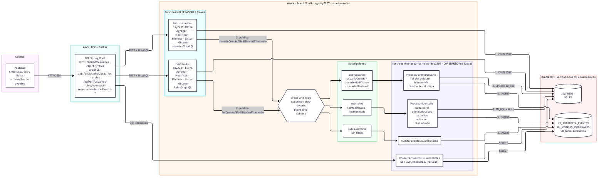

# Sistema de Gestión de Usuarios y Roles — DSY2207 Evaluación Final Transversal

Desarrollo Cloud Native II (DSY2207) — Duoc UC · Semana 9
Integrantes: Cristóbal Camps · Cynthia Torres
Repositorio: https://github.com/cricamps/vet

Backend cloud con **funciones serverless Java** (REST + GraphQL), un **BFF Spring Boot** que las orquesta por ambos canales y **Azure Event Grid** como tecnología de eventos, sobre Oracle Autonomous Database.



## 1. Requerimiento y cómo se cumple

CRUD de usuarios y roles ejecutado por funciones serverless, más dos reacciones automáticas basadas en eventos:

| Requerimiento | Evento | Consumidora | Resultado |
|---|---|---|---|
| Al **crear un usuario** se le asigna un rol por defecto | `UsuariosRoles.UsuarioCreado` | `ProcesarEventoUsuario` | El usuario queda con el rol `CONSULTA` + notificaciones `ROL_ASIGNADO` y `BIENVENIDA` |
| Al **eliminar un rol** se actualizan sus usuarios y se les quita | `UsuariosRoles.RolEliminado` (`usuariosAfectados[]`) | `ProcesarEventoRol` | Los usuarios quedan **sin rol** (`idRol = null`) + notificación `ROL_QUITADO` |

Mínimos del alcance: 1 BFF ✔ · 2+ funciones serverless con API REST ✔ (más GraphQL) · 1+ componente de eventos ✔ (topic, 3 suscripciones y 4 funciones consumidoras/consulta).

Detalle completo: [`docs/arquitectura-eft.md`](docs/arquitectura-eft.md).

## 2. Componentes

| Carpeta | Componente | Despliegue |
|---|---|---|
| `bff-service/` | BFF Spring Boot 3.3 (Java 17) — REST `/api/bff/usuarios`, `/api/bff/roles`; GraphQL `/api/bff/graphql/usuarios`, `/api/bff/graphql/roles`; consultas `/api/bff/usuarios-roles/eventos/*` | Docker en AWS EC2 |
| `function-usuarios/` | Funciones Java: Agregar/Listar/Obtener/Modificar/EliminarUsuario + `UsuariosGraphQL`. **Generadoras** de eventos | Azure Functions `func-usuarios-dsy2207-18514` |
| `function-roles/` | Funciones Java: Agregar/Listar/Obtener/Modificar/EliminarRol + `RolesGraphQL`. **Generadoras** de eventos | Azure Functions `func-roles-dsy2207-14376` |
| `function-eventos-usuarios-roles/` | **Consumidoras** (Event Grid trigger): `AuditarEventoUsuariosRoles`, `ProcesarEventoUsuario`, `ProcesarEventoRol` + `ConsultarEventosUsuariosRoles` (HTTP) | Azure Functions `func-eventos-usuarios-roles-dsy2207` |
| — | Event Grid topic `usuarios-roles-events-37854` + suscripciones `sub-auditoria`, `sub-usuarios`, `sub-roles` | Azure (Brazil South) |
| `db/` | `script_completo_eft.sql` (base nueva), o `script_oracle.sql` + `script_eventos_s8.sql` + `script_eft_migracion.sql` (base existente) | Oracle Autonomous DB `usuariosroles` (OCI) |
| `docs/` | Arquitectura, despliegue, colección Postman | — |

> Las carpetas `function-eventos-productora/` y `function-eventos-consumidora/` pertenecen a la Formativa 5 (S7, caso veterinaria) y no forman parte del caso de la EFT.

## 3. Ejecutar

**Local con Docker** (Oracle XE + funciones + BFF): `docker compose up --build` → BFF en `http://localhost:8080`.

**Cloud** (lo que se muestra en el video): funciones en Azure, BFF en EC2. Pasos en [`docs/despliegue-eft.md`](docs/despliegue-eft.md). Las URLs de las funciones se inyectan al BFF por variables de entorno (`FUNCION_USUARIOS_URL`, `FUNCION_ROLES_URL`, `FUNCION_EVENTOS_UR_URL`), así que al cambiar de entorno (Docker Lab / EC2) no se recompila nada.

## 4. Endpoints del BFF

| Método | Ruta | Función que invoca |
|---|---|---|
| GET | `/api/bff/usuarios` · `/api/bff/usuarios/{id}` | ListarUsuarios · ObtenerUsuario |
| POST | `/api/bff/usuarios` | AgregarUsuario → `UsuarioCreado` |
| PUT | `/api/bff/usuarios/{id}` | ModificarUsuario → `UsuarioModificado` |
| DELETE | `/api/bff/usuarios/{id}` | EliminarUsuario → `UsuarioEliminado` |
| GET/POST/PUT/DELETE | `/api/bff/roles[/{id}]` | CRUD de roles → `RolCreado/Modificado/Eliminado` |
| POST | `/api/bff/graphql/usuarios` | UsuariosGraphQL (`{ "query": "...", "variables": {} }`) |
| POST | `/api/bff/graphql/roles` | RolesGraphQL |
| GET | `/api/bff/usuarios/{id}/notificaciones` | ConsultarEventosUsuariosRoles |
| GET | `/api/bff/usuarios-roles/eventos/{auditoria\|procesados\|notificaciones\|usuarios}` | ConsultarEventosUsuariosRoles |

Las respuestas del CRUD incluyen los headers `X-Evento-Tipo`, `X-Evento-Id` y `X-Evento-Publicado`, que muestran el evento que se publicó en Event Grid.

Ejemplo GraphQL vía BFF:

```json
POST /api/bff/graphql/usuarios
{ "query": "mutation { agregarUsuario(nombreUsuario: \"Ana\", pais: \"Chile\") { idUsuario idRol } }" }
```

## 5. Pruebas

Colección Postman: [`docs/postman_collection_eft.json`](docs/postman_collection_eft.json) (variable `bffUrl` = IP pública actual de la EC2).

1. Flujo de eventos por REST (requerimientos 1 y 2, rol protegido 409).
2. Último eslabón: auditoría, eventos procesados, notificaciones.
3. Flujo por GraphQL vía BFF (los mismos dos requerimientos por el canal GraphQL).
4. Funciones directas (solo diagnóstico).

Pruebas unitarias: `mvn test` en `function-usuarios`, `function-roles` y `function-eventos-usuarios-roles`.

## 6. Trabajo colaborativo

Ramas por entrega (`feature/s3…`, `feature/s5…`, `feature/s7-event-grid`, `feature/s8-eventos-usuarios-roles`, `feature/eft-s9`) integradas a `main` mediante Pull Requests revisados por el otro integrante. Los secretos (`ORACLE_DB_*`, `EVENTGRID_TOPIC_*`) viven como App Settings y nunca se suben (`local.settings.json` y `*.env` en `.gitignore`).
