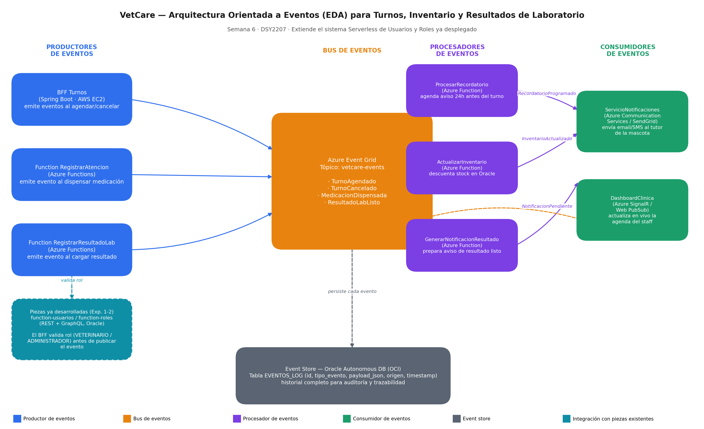

# Arquitectura orientada a eventos (EDA) — Semana 6 (DSY2207, Experiencia 3)

> Formativa 4: "Conociendo sistemas cloud con arquitectura basada en eventos". Extiende el sistema de Usuarios y Roles ya desplegado (Experiencias 1 y 2) con una capa orientada a eventos para VetCare, la clínica veterinaria del caso.

## Caso

**Empresa:** VetCare, una clínica veterinaria.

Se agrega, sobre `function-usuarios` / `function-roles` (ya desplegadas, REST + GraphQL sobre Oracle), una capa orientada a eventos para gestionar turnos, dispensación de medicamentos y entrega de resultados de laboratorio.

### Requisitos funcionales

- **RF1.** Agendar y cancelar un turno veterinario, generando un evento por cada acción (`TurnoAgendado` / `TurnoCancelado`).
- **RF2.** Enviar automáticamente un recordatorio (email o SMS) al dueño de la mascota 24 horas antes del turno.
- **RF3.** Descontar el stock de medicamentos cuando se registra una atención con medicación dispensada.
- **RF4.** Notificar al dueño de la mascota apenas un resultado de laboratorio esté disponible.
- **RF5.** Mantener un historial completo y consultable de todos los eventos, para auditoría.
- **RF6.** Reutilizar el control de acceso ya construido: solo un usuario con rol `VETERINARIO` o `ADMINISTRADOR` puede generar estos eventos.

## Diagrama

*Productores → Azure Event Grid (`vetcare-events`) → Procesadores (Azure Functions) → Consumidores, con Oracle como event store e integración con `function-usuarios`/`function-roles` para el control de acceso.*

## Piezas del sistema

### 1. Productores de eventos

| Pieza | Finalidad / funcionalidad | Ejemplo de usabilidad |
|---|---|---|
| **BFF Turnos** (Spring Boot, AWS EC2) | Expone la API de agendar/cancelar turnos; valida el rol del usuario contra `function-roles` antes de publicar el evento. | Una recepcionista agenda el control de "Firulais"; el BFF publica `TurnoAgendado`. |
| **Function RegistrarAtencion** (Azure Functions) | Registra una atención clínica y publica `MedicacionDispensada` con el detalle del insumo usado. | El veterinario aplica un antiparasitario y registra la atención. |
| **Function RegistrarResultadoLab** (Azure Functions) | Carga un resultado de examen y publica `ResultadoLabListo`. | El laboratorio entrega un hemograma, se carga y se dispara el aviso. |

### 2. Bus de eventos

**Azure Event Grid** — tópico `vetcare-events`. Desacopla productores de consumidores; distribuye los 4 tipos de evento a todos los suscriptores sin que el productor conozca quién los consume. Se eligió por coherencia con el resto del stack Azure ya usado en el curso.

### 3. Procesadores de eventos

| Pieza | Finalidad / funcionalidad | Ejemplo de usabilidad |
|---|---|---|
| **ProcesarRecordatorio** | Al recibir `TurnoAgendado`, calcula el momento del recordatorio y publica `RecordatorioProgramado`. | Programa el aviso del control de "Firulais" sin intervención humana. |
| **ActualizarInventario** | Al recibir `MedicacionDispensada`, descuenta stock en Oracle y publica `InventarioActualizado`. | El stock del antiparasitario baja automáticamente tras dispensarlo. |
| **GenerarNotificacionResultado** | Al recibir `ResultadoLabListo`, arma el aviso y publica `NotificacionPendiente`. | Prepara "El resultado del hemograma de Firulais ya está disponible". |

### 4. Consumidores de eventos

| Pieza | Finalidad / funcionalidad | Ejemplo de usabilidad |
|---|---|---|
| **ServicioNotificaciones** (Azure Communication Services / SendGrid) | Escucha `RecordatorioProgramado` y `NotificacionPendiente`; envía el email/SMS real. | El dueño recibe un SMS: "Recuerda el control de mañana a las 10:00". |
| **DashboardClinica** (Azure SignalR / Web PubSub) | Escucha todos los eventos y actualiza en vivo la agenda del personal. | Al cancelar un turno, la agenda de recepción libera el horario sin refrescar. |

### 5. Event store

**Oracle Autonomous DB — tabla `EVENTOS_LOG`** (`id`, `tipo_evento`, `payload_json`, `origen`, `timestamp`), en la misma base ya usada por Usuarios y Roles. Da trazabilidad completa: si un dueño reclama que no recibió un recordatorio, se consulta `EVENTOS_LOG` para confirmar si y cuándo se generó `TurnoAgendado`.

### 6. Integración con piezas existentes

`function-usuarios` / `function-roles` (Experiencias 1-2) no se rediseñan: se reutilizan como servicio de autenticación/autorización. Un usuario con rol `CONSULTA` puede ver turnos, pero el BFF le impide agendar uno nuevo porque valida su rol antes de publicar el evento.

---
*Ver también `docs/arquitectura.md` (diseño original de Usuarios y Roles) y `DSY2207_Exp3_S6_formato_de_respuesta.docx` (entrega formal de la actividad).*
