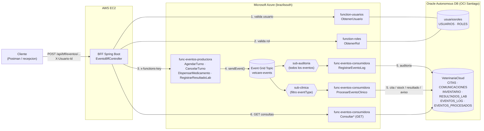

# Arquitectura orientada a eventos implementada — Semana 7 (DSY2207, Experiencia 3)

> Actividad Formativa 5: **"Construyendo un sistema cloud con arquitectura basada en eventos"**.
> Implementa en Azure la capa de eventos de VetCare diseñada en la semana 6 (`docs/arquitectura-eda-s6.md`), usando las 4 piezas que indica la guía: **Event Grid Topic → función generadora → función consumidora → suscripción**.
> Los datos clínicos viven en la base **VeterinariaCloud** (Oracle Autonomous DB `vetcloud`: CLIENTES, MASCOTAS, EMPLEADOS, CITAS, COMUNICACIONES, INVENTARIO, RESULTADOS_LABORATORIO); el control de acceso sigue en la base **usuariosroles** (USUARIOS/ROLES de las Experiencias 1-2).

## 1. Requerimiento abordado

VetCare (clínica veterinaria) necesita que las acciones clínicas del día a día disparen reacciones automáticas **sin acoplar** el servicio que las registra con los que reaccionan:

| RF | Requerimiento | Evento | Reacción implementada |
|---|---|---|---|
| RF1 | Agendar / cancelar una cita | `VetCare.TurnoAgendado` / `VetCare.TurnoCancelado` | Inserta la cita en `CITAS` (estado `AGENDADA`) / la pasa a `CANCELADA` |
| RF2 | Recordatorio 24 h antes de la cita | `VetCare.TurnoAgendado` | Crea en `COMUNICACIONES` un email `PROGRAMADO` para `fechaHora − 24 h` al dueño (se marca `CANCELADO` si la cita se cancela, y se avisa la cancelación) |
| RF3 | Descontar stock al dispensar medicación | `VetCare.MedicacionDispensada` | Descuenta `INVENTARIO.STOCK_ACTUAL` y genera alerta `STOCK_BAJO` (tabla `NOTIFICACIONES`) si queda en o bajo `STOCK_MINIMO` |
| RF4 | Registrar el resultado de laboratorio y avisar al dueño | `VetCare.ResultadoLabListo` | Inserta en `RESULTADOS_LABORATORIO` y crea el aviso en `COMUNICACIONES` |
| RF5 | Historial auditable de todos los eventos | todos | Guarda el evento completo (JSON) en `EVENTOS_LOG` y el resultado de cada procesamiento en `EVENTOS_PROCESADOS` |
| RF6 | Solo `ADMINISTRADOR` u `OPERADOR` pueden generar eventos | — | El BFF valida usuario y rol contra `function-usuarios` / `function-roles` (rol `CONSULTA` → 403) |

## 2. Diagrama

(Fuente editable: `arquitectura-eda-s7.mmd`, Mermaid.)

## 3. Piezas y su finalidad

### 3.1 Punto de entrada — BFF (Spring Boot, AWS EC2)

`EventoBffController` (`/api/bff/eventos`). Recibe la petición del cliente con el header `X-Usuario-Id`, consulta `function-usuarios` (¿existe? ¿qué rol tiene?) y `function-roles` (¿ese rol está autorizado?), y recién entonces llama a la función generadora enviando la **function key** (`x-functions-key`). Responde **202 Accepted**: el evento fue aceptado, su efecto ocurre de forma asíncrona.

| Método | Ruta BFF | Evento que genera |
|---|---|---|
| POST | `/api/bff/eventos/turnos` | `VetCare.TurnoAgendado` |
| POST | `/api/bff/eventos/turnos/{idTurno}/cancelar` | `VetCare.TurnoCancelado` |
| POST | `/api/bff/eventos/medicacion` | `VetCare.MedicacionDispensada` |
| POST | `/api/bff/eventos/laboratorio` | `VetCare.ResultadoLabListo` |
| GET | `/api/bff/eventos/consultas/{eventos\|turnos\|inventario\|notificaciones}` | — (último eslabón) |

### 3.2 Función generadora de eventos — `func-eventos-productora` (Java 17, Azure Functions)

4 funciones HTTP (`authLevel = FUNCTION`): `AgendarTurno`, `CancelarTurno`, `DispensarMedicamento`, `RegistrarResultadoLab`. Cada una valida el cuerpo (`ConstructorEventos`, con tests unitarios) y publica **un** `EventGridEvent` con `EventGridPublisherClient` (SDK `azure-messaging-eventgrid`, el mismo del material de la semana).

- `subject` identifica el recurso: `/vetcare/turnos/TUR-XXXXXXXX`, `/vetcare/inventario/MED-001`, `/vetcare/laboratorio/LAB-XXXXXXXX`.
- `eventType` identifica el hecho de negocio y es lo que usan las suscripciones para filtrar.
- A diferencia del ejemplo del material, **el endpoint y la key del topic no están en el código**: se leen de las App Settings `EVENTGRID_TOPIC_ENDPOINT` y `EVENTGRID_TOPIC_KEY` (la key nunca llega a GitHub).
- El cliente de Event Grid se crea una vez por instancia y se reutiliza (buena práctica FaaS).

### 3.3 Bus de eventos — Azure Event Grid Topic `vetcare-events-*`

Esquema **Event Grid Schema**. Desacopla completamente al productor de los consumidores: la productora no sabe cuántas funciones reaccionan ni qué hacen. Se eligió Event Grid (y no Event Hubs ni Service Bus) porque es el servicio de **enrutamiento** de eventos discretos de baja latencia, con integración nativa con Azure Functions y modelo push, ideal para serverless; Event Hubs apunta a ingesta masiva de telemetría y Service Bus a mensajería transaccional/ordenada entre servicios.

### 3.4 Suscripciones (fan-out)

| Suscripción | Filtro | Endpoint (Azure Function) | Propósito |
|---|---|---|---|
| `sub-auditoria` | ninguno (todos los eventos) | `RegistrarEventoLog` | Event store / auditoría (RF5) |
| `sub-clinica` | `eventType` ∈ {TurnoAgendado, TurnoCancelado, MedicacionDispensada, ResultadoLabListo} | `ProcesarEventoClinico` | Lógica de negocio (RF1-RF4) |

Un mismo evento llega a **ambas** funciones de manera independiente: si mañana se agrega un consumidor nuevo (p.ej. envío real de SMS con Azure Communication Services) basta con crear una suscripción más, sin tocar la productora.

### 3.5 Funciones consumidoras — `func-eventos-consumidora` (Java 17, Azure Functions)

- **`RegistrarEventoLog`** (`@EventGridTrigger`): guarda el evento completo en `EVENTOS_LOG`.
- **`ProcesarEventoClinico`** (`@EventGridTrigger`): según `eventType` crea/cancela la cita y su recordatorio (`CITAS`, `COMUNICACIONES`), descuenta stock (`INVENTARIO`, con alerta de stock bajo) o registra el resultado de laboratorio (`RESULTADOS_LABORATORIO`) y avisa al dueño. El dueño y su email se obtienen de `MASCOTAS` → `CLIENTES`: el productor solo envía ids.
- **`Consultar`** (HTTP GET `/api/consultas/{eventos|procesados|citas|comunicaciones|inventario|resultados|alertas}`): muestra el resultado final del flujo (lo usa el BFF y sirve para el video).

**Idempotencia (entrega "at least once").** Event Grid puede entregar un evento más de una vez. Por eso `ProcesarEventoClinico` inserta primero el id del evento en `EVENTOS_PROCESADOS` (PK) **en la misma transacción** que el cambio de negocio: si el evento llega repetido, la PK falla (`ORA-00001`), se registra "duplicado, se ignora" y **no se crea otra cita ni se descuenta dos veces el stock**. `EVENTOS_LOG` usa la misma técnica para la auditoría.

**Reintentos vs. rechazos.** Si Oracle falla (error técnico), la función hace rollback y relanza la excepción: Event Grid reintenta la entrega (hasta 10 intentos, TTL 24 h). Los errores de negocio (mascota o veterinario inexistente, stock insuficiente, cita ya cancelada) quedan registrados como `RECHAZADO: …` en `EVENTOS_PROCESADOS` y no se reintentan, porque reintentarlos no cambiaría el resultado.

### 3.6 Persistencia — Oracle

- **VeterinariaCloud (`vetcloud`)**: tablas existentes del sistema veterinario (`CLIENTES`, `MASCOTAS`, `EMPLEADOS`, `CITAS`, `COMUNICACIONES`, `INVENTARIO`, `RESULTADOS_LABORATORIO`) + tablas propias de la capa de eventos agregadas por `db/script_eventos_s7.sql`: `EVENTOS_LOG`, `EVENTOS_PROCESADOS` y `NOTIFICACIONES`. El script también carga un veterinario y dos medicamentos para la demo.
- **usuariosroles**: `USUARIOS` / `ROLES` (sin cambios), usada por el BFF para autorizar.

## 4. Flujo de punta a punta (ejemplo para el video)

1. Recepción (usuario 1, `ADMINISTRADOR`) llama `POST /api/bff/eventos/turnos` con `idMascota=1` (Firulais, dueña Ana Soto) e `idVeterinario=1` (Dra. Camila Rojas).
2. BFF → `function-usuarios` (usuario 1 tiene rol 1) → `function-roles` (rol 1 = ADMINISTRADOR ✔).
3. BFF → `AgendarTurno` (con function key) → valida y publica `VetCare.TurnoAgendado` en el topic → responde 202 con `idTurno`.
4. Event Grid entrega el evento a `sub-auditoria` y `sub-clinica`.
5. `RegistrarEventoLog` guarda el JSON en `EVENTOS_LOG`; `ProcesarEventoClinico` inserta la cita en `CITAS` y programa el recordatorio en `COMUNICACIONES`.
6. `GET /api/bff/eventos/consultas/citas` y `/comunicaciones` muestran la cita y el recordatorio. En el portal: métricas del topic (Published / Delivered), de la suscripción y logs de la función consumidora.
7. Contraejemplo: un usuario con rol `CONSULTA` (se crea en la preparación, ver `despliegue-s7.md`) intenta lo mismo → **403**, el evento nunca se publica.

## 5. Relación con los indicadores de logro

- **IL8 (diseño EDA):** productores, bus, suscripciones con filtro, consumidores y event store separados; diagrama y tabla RF → evento → reacción.
- **IL9 (integración con microservicios y serverless):** BFF Spring Boot + funciones existentes (usuarios/roles) + nuevas funciones productora/consumidora + Event Grid + las dos bases Oracle (usuariosroles y VeterinariaCloud).
- **IL10 (repositorio colaborativo):** todo el código y la documentación en `github.com/cricamps/vet`, commits de ambos integrantes.

---
*Pasos de despliegue: `docs/despliegue-s7.md`. Pruebas: `docs/postman-s7.md` + `docs/postman_collection_s7.json`.*
