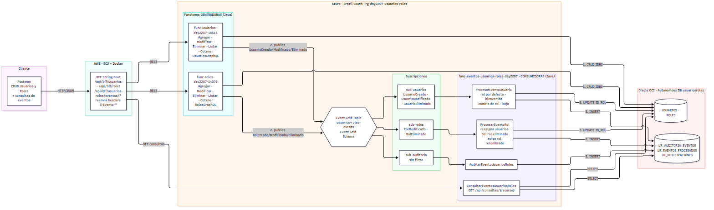
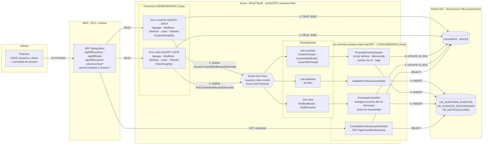

# Arquitectura orientada a eventos — Semana 8 (Actividad Sumativa 3)

**"Aplicando tecnologías de eventos en arquitecturas cloud"** — se completa el *Sistema de Gestión de Usuarios y Roles* de la Sumativa 1 incorporando **Azure Event Grid**. Las funciones generadoras y consumidoras de eventos están desarrolladas en **Java 17** y desplegadas en **Azure Functions**.

Fuente Mermaid del diagrama (docs/arquitectura-eda-s8.mmd)

## 1. Qué parte del requerimiento resuelve Event Grid

El CRUD de usuarios y roles sigue siendo **síncrono** (REST/GraphQL a través del BFF). Lo que se resuelve con eventos son las **reacciones** a esos cambios, que no deben bloquear la respuesta al cliente ni acoplar a las funciones CRUD con cada interesado:

| Necesidad del sistema | Evento | Quién reacciona | Efecto |
|---|---|---|---|
| Trazabilidad de todo cambio sobre usuarios y roles | Todos (6 tipos) | `AuditarEventoUsuariosRoles` | Fila en `UR_AUDITORIA_EVENTOS` con el JSON completo del evento |
| Todo usuario debe tener un rol | `UsuarioCreado` / `UsuarioModificado` sin `idRol` | `ProcesarEventoUsuario` | Se asigna el rol por defecto `CONSULTA` (`USUARIOS.ID_ROL`) + notificación `ROL_ASIGNADO` |
| Informar al usuario al ser creado | `UsuarioCreado` | `ProcesarEventoUsuario` | Notificación `BIENVENIDA` con su rol final |
| Informar cambios de permisos | `UsuarioModificado` con `cambioDeRol = true` | `ProcesarEventoUsuario` | Notificación `CAMBIO_ROL` ("de OPERADOR a ADMINISTRADOR") |
| Registrar bajas | `UsuarioEliminado` | `ProcesarEventoUsuario` | Notificación `BAJA` (se conserva aunque el usuario ya no exista) |
| Poder eliminar un rol en uso sin dejar usuarios huérfanos | `RolEliminado` (con `usuariosAfectados`) | `ProcesarEventoRol` | Los usuarios afectados se reasignan al rol `CONSULTA` + notificación `REASIGNACION_ROL` |
| Avisar cuando un rol cambia de nombre | `RolModificado` | `ProcesarEventoRol` | Notificación `ROL_RENOMBRADO` a cada usuario con ese rol |

Antes de la S8, `DELETE /api/roles/{id}` fallaba con `ORA-02292` si el rol tenía usuarios (FK `FK_USUARIOS_ROL`). Ahora `function-roles` desasigna a esos usuarios en la misma transacción, publica `RolEliminado` con la lista de afectados y la consumidora los reasigna: **consistencia eventual**. El rol por defecto (`CONSULTA`) no puede eliminarse (HTTP 409).

## 2. Componentes

| # | Componente | Tecnología / nube | Finalidad |
|---|---|---|---|
| 1 | **BFF** `bff-service` | Spring Boot 3 + Docker, AWS EC2 | Punto de entrada único. Orquesta el CRUD (valida que el rol exista antes de crear/modificar un usuario), reenvía los headers `X-Evento-*` de las funciones y expone las consultas del flujo de eventos. |
| 2 | **Funciones de Usuario** `func-usuarios-dsy2207-18514` | Azure Functions Java 17 (HTTP trigger) | CRUD sobre `USUARIOS` (REST + GraphQL). **Generadoras**: publican `UsuarioCreado`, `UsuarioModificado` (incluye `idRolAnterior` y `cambioDeRol`) y `UsuarioEliminado` (foto previa). |
| 3 | **Funciones de Rol** `func-roles-dsy2207-14376` | Azure Functions Java 17 (HTTP trigger) | CRUD sobre `ROLES` (REST + GraphQL). **Generadoras**: publican `RolCreado`, `RolModificado` (incluye `nombreAnterior`) y `RolEliminado` (incluye `usuariosAfectados`). |
| 4 | **Event Grid Topic** `usuarios-roles-events-NNNNN` | Azure Event Grid (custom topic, Event Grid Schema) | Bus de eventos: recibe cada evento una vez y lo distribuye (*fan-out*) a todas las suscripciones cuyo filtro coincida. Reintenta la entrega si el consumidor falla. |
| 5 | **Suscripciones** `sub-auditoria`, `sub-usuarios`, `sub-roles` | Event Grid event subscriptions (endpoint *Azure Function*) | Enrutan por `eventType`: auditoría sin filtro; usuarios y roles con *included event types*. 10 intentos de entrega, TTL 24 h. |
| 6 | **Funciones consumidoras** `func-eventos-usuarios-roles-dsy2207` | Azure Functions Java 17 (**Event Grid trigger**) | `AuditarEventoUsuariosRoles`, `ProcesarEventoUsuario`, `ProcesarEventoRol`: aplican los efectos de la tabla anterior de forma **idempotente** (`UR_EVENTOS_PROCESADOS`). |
| 7 | **Función de consultas** `ConsultarEventosUsuariosRoles` | Azure Functions Java 17 (HTTP trigger, misma app) | `GET /api/consultas/{auditoria|procesados|notificaciones|usuarios}`: evidencia el último eslabón del flujo. |
| 8 | **Base de datos** `usuariosroles` | Oracle Autonomous Database (OCI) | `USUARIOS`, `ROLES` (S1) + `UR_AUDITORIA_EVENTOS`, `UR_EVENTOS_PROCESADOS`, `UR_NOTIFICACIONES` (S8, `db/script_eventos_s8.sql`). |

## 3. Catálogo de eventos

Todos usan el **Event Grid Schema**: `id`, `subject`, `eventType`, `eventTime`, `data`, `dataVersion = "1.0"`.

| eventType | subject | data |
|---|---|---|
| `UsuariosRoles.UsuarioCreado` | `/usuarios/{id}` | `idUsuario, nombreUsuario, profesionUsuario, pais, idRol, canal` |
| `UsuariosRoles.UsuarioModificado` | `/usuarios/{id}` | lo anterior + `idRolAnterior, cambioDeRol, nombreAnterior` |
| `UsuariosRoles.UsuarioEliminado` | `/usuarios/{id}` | datos del usuario antes de eliminarlo |
| `UsuariosRoles.RolCreado` | `/roles/{id}` | `idRol, nombreRol, canal` |
| `UsuariosRoles.RolModificado` | `/roles/{id}` | `idRol, nombreRol, nombreAnterior, canal` |
| `UsuariosRoles.RolEliminado` | `/roles/{id}` | `idRol, nombreRol, usuariosAfectados[], rolReemplazo, canal` |

`canal` indica si el cambio llegó por `REST` o por `GraphQL`: ambos canales pasan por la misma capa de servicio (`UsuarioService` / `RolService`) y generan exactamente el mismo evento.

## 4. Flujo de punta a punta (ejemplo: crear un usuario sin rol)

1. Postman → `POST /api/bff/usuarios` `{ "nombreUsuario": "Ana Pérez", ... }` (sin `idRol`).
2. BFF → `POST func-usuarios/api/usuarios`.
3. `AgregarUsuario` inserta en `USUARIOS` (con `ID_ROL = NULL`) y **publica** `UsuarioCreado` en el topic. Responde `201` con headers `X-Evento-Tipo`, `X-Evento-Id`, `X-Evento-Publicado: true`, que el BFF reenvía a Postman.
4. Event Grid entrega el evento a `sub-auditoria` y a `sub-usuarios` (en paralelo).
5. `AuditarEventoUsuariosRoles` guarda el evento en `UR_AUDITORIA_EVENTOS`.
6. `ProcesarEventoUsuario` asigna el rol `CONSULTA`, crea las notificaciones `ROL_ASIGNADO` y `BIENVENIDA` y marca el evento `PROCESADO`.
7. Postman → `GET /api/bff/usuarios/{id}` (ahora tiene `idRol` de CONSULTA) y `GET /api/bff/usuarios/{id}/notificaciones`.

## 5. Decisiones de diseño

- **Publicar después del commit**: el evento se publica solo si el cambio en Oracle fue exitoso; así ningún consumidor reacciona a algo que no ocurrió.
- **Publicación *best effort***: si Event Grid no responde, el CRUD no se revierte; se informa con `X-Evento-Publicado: false` y queda en el log de la función.
- **Idempotencia**: Event Grid garantiza entrega *al menos una vez*. Cada consumidor registra `(ID_EVENTO, CONSUMIDOR)` en `UR_EVENTOS_PROCESADOS` dentro de la misma transacción que sus efectos; un duplicado se ignora.
- **Errores**: un error de Oracle relanza la excepción → Event Grid reintenta (hasta 10 veces). Un error de negocio (usuario ya eliminado, rol por defecto inexistente) se guarda como `RECHAZADO` y no se reintenta.
- **Consistencia eventual** al eliminar roles: la transacción de `function-roles` es corta (desasignar y borrar) y la reasignación ocurre de forma asíncrona.
- **Secretos fuera del código**: `EVENTGRID_TOPIC_ENDPOINT`, `EVENTGRID_TOPIC_KEY` y `ORACLE_DB_*` son App Settings de cada Function App.
- **Multicloud**: BFF en AWS, cómputo serverless y bus de eventos en Azure, base de datos en Oracle OCI. La guía S8 compara Event Grid con Amazon EventBridge y Google Cloud Pub/Sub, que serían los equivalentes si se moviera el bus de eventos a otra nube.
