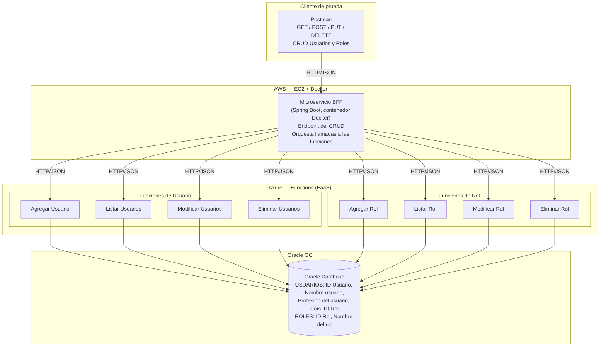

# Arquitectura del sistema — Gestión de Usuarios y Roles

Diseño acordado en equipo (diagrama de referencia: `ARQ-USUARIOS-ROLES`), arquitectura **multicloud**: BFF en AWS, funciones serverless en Azure, base de datos en Oracle OCI.

## Diagrama

## Explicación de los componentes

### 1. Cliente (Postman)

Consumidor de prueba usado para demostrar, en el video, cada operación CRUD contra el BFF: `GET`, `POST`, `PUT`, `DELETE` sobre usuarios y roles.

### 2. BFF — AWS (EC2 + Docker)

Es el único punto de entrada del sistema ("endpoint del CRUD"). Se construyó con **Spring Boot** (cumpliendo el requisito del framework) y se empaqueta como imagen Docker para desplegarse sobre una instancia **EC2** de AWS. No contiene lógica de negocio de usuarios ni de roles: su responsabilidad es **orquestar** las llamadas hacia las funciones serverless de Azure y devolver al consumidor una respuesta JSON consolidada.

Como no existe frontend en este requerimiento, el BFF cumple el rol de fachada que en un escenario real consumiría un frontend, y en esta actividad se prueba directamente con Postman durante el video de demostración.

Las URLs de las funciones **no están hardcodeadas**: se inyectan por variables de entorno (`FUNCION_USUARIOS_URL`, `FUNCION_ROLES_URL`) para poder cambiarlas fácilmente cuando el proyecto se sube al Docker Lab o a EC2, tal como piden las instrucciones de la actividad.

### 3. Funciones Serverless — Azure Functions (FaaS)

8 funciones HTTP-triggered en Java, una por cada operación CRUD y por entidad — separación 1 a 1 con el diagrama del equipo:

**Usuarios**: `Agregar Usuario` (POST), `Listar Usuarios` (GET), `Modificar Usuarios` (PUT), `Eliminar Usuarios` (DELETE).
**Roles**: `Agregar Rol` (POST), `Listar Rol` (GET), `Modificar Rol` (PUT), `Eliminar Rol` (DELETE).

(El proyecto agrega además `Obtener Usuario`/`Obtener Rol` por id, como utilidades internas que usa el BFF para validar datos antes de orquestar — no rompen el conteo mínimo de 2 funciones exigido por el caso, lo superan.)

Cada función es stateless: no mantiene ningún estado entre invocaciones, cada ejecución abre su propia conexión JDBC a Oracle, hace su trabajo y responde. Esto sigue la buena práctica "Enfoque en funciones" de la guía de la semana 3 (funciones pequeñas, enfocadas, sin estado).

### 4. Base de datos — Oracle OCI

Persistencia relacional en **Oracle Cloud Infrastructure**, con dos tablas:

- `USUARIOS`: `ID_USUARIO`, `NOMBRE_USUARIO`, `PROFESION_USUARIO`, `PAIS`, `ID_ROL` (FK a `ROLES`).
- `ROLES`: `ID_ROL`, `NOMBRE_ROL`.

La relación usuario–rol es **1 a N** (un usuario tiene un rol, un rol puede tener muchos usuarios), representada con una llave foránea directa en `USUARIOS`, tal como quedó definido en el diagrama de arquitectura del equipo (sin tabla intermedia).

## Por qué esta arquitectura y no otra

- **Multicloud por diseño**: BFF en AWS, funciones en Azure y base de datos en Oracle OCI — refleja un patrón real de la industria donde cada proveedor se usa para lo que mejor resuelve (cómputo persistente para el BFF en AWS, FaaS madura en Azure, y la base de datos relacional en Oracle).
- **Separación de responsabilidades**: cada función atiende una única operación sobre una única entidad (usuarios o roles), siguiendo el principio de responsabilidad única aplicado a FaaS.
- **El BFF evita exponer directamente las funciones**: centraliza el punto de entrada y agrega la validación cruzada (ej. que el rol exista antes de crear un usuario) sin acoplar las funciones entre sí.
- **Costos y escalado**: al ser funciones serverless, cada una escala de forma independiente según la demanda de esa operación puntual.
- **Cumple el mínimo exigido por el caso**: 1 componente BFF + mínimo 2 funciones serverless (aquí, 8), sin frontend.

## Flujo de una petición (ejemplo: crear usuario con un rol)

1. El cliente llama `POST /api/bff/usuarios` al BFF con el payload del usuario (`nombreUsuario`, `profesionUsuario`, `pais`, `idRol`).
2. El BFF llama a `Obtener Rol` en Azure para validar que el `idRol` exista. Si no existe, responde `400` sin llegar a crear el usuario.
3. El BFF llama a `Agregar Usuario` en Azure, que inserta el registro en `USUARIOS` (incluyendo el `ID_ROL`) en Oracle OCI.
4. El BFF devuelve al cliente el usuario creado, con su rol ya asociado.

Este flujo es el que se debe **mostrar y explicar en el video** (parte II de la entrega), evidenciando el dominio de la arquitectura — que fue justamente la observación pendiente de la entrega anterior.
