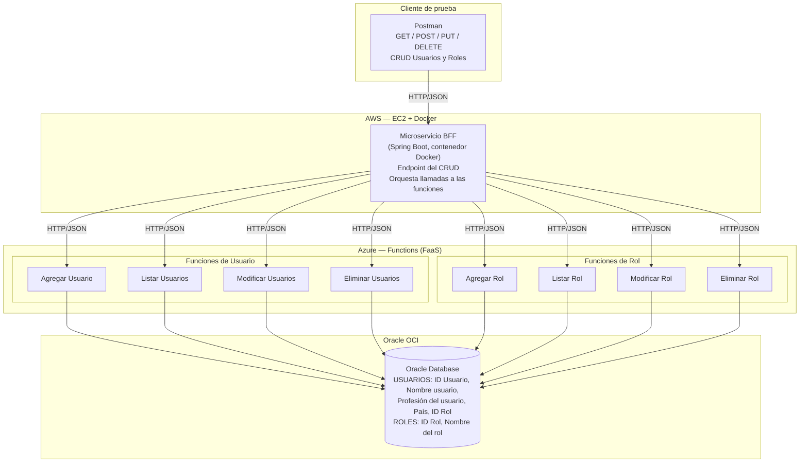

# Arquitectura del sistema — Gestión de Usuarios y Roles

Diseño acordado en equipo (diagrama de referencia: `ARQ-USUARIOS-ROLES`), arquitectura **multicloud**: BFF en AWS, funciones serverless en Azure, base de datos en Oracle OCI.

## Diagrama


```mermaid
flowchart TB
    subgraph Cliente["Cliente de prueba"]
        C["Postman\nGET / POST / PUT / DELETE\nCRUD Usuarios y Roles"]
    end

    subgraph AWS["AWS — EC2 + Docker"]
        BFF["Microservicio BFF\n(Spring Boot, contenedor Docker)\nEndpoint del CRUD\nOrquesta llamadas a las funciones"]
    end

    subgraph AZURE["Azure — Functions (FaaS)"]
        direction LR
        subgraph FU["Funciones de Usuario"]
            direction TB
            AU[Agregar Usuario]
            LU[Listar Usuarios]
            MU[Modificar Usuarios]
            EU[Eliminar Usuarios]
        end
        subgraph FR["Funciones de Rol"]
            direction TB
            AR[Agregar Rol]
            LR[Listar Rol]
            MR[Modificar Rol]
            ER[Eliminar Rol]
        end
    end

    subgraph ORACLE["Oracle OCI"]
        DB[("Oracle Database\nUSUARIOS: ID Usuario, Nombre usuario,\nProfesión del usuario, País, ID Rol\nROLES: ID Rol, Nombre del rol")]
    end

    C -->|HTTP/JSON| BFF
    BFF -->|HTTP/JSON| AU
    BFF -->|HTTP/JSON| LU
    BFF -->|HTTP/JSON| MU
    BFF -->|HTTP/JSON| EU
    BFF -->|HTTP/JSON| AR
    BFF -->|HTTP/JSON| LR
    BFF -->|HTTP/JSON| MR
    BFF -->|HTTP/JSON| ER
    AU & LU & MU & EU --> DB
    AR & LR & MR & ER --> DB
```

## Explicación de los componentes

### 1. Cliente (Postman)

Consumidor de prueba usado para demostrar, en el video, cada operación CRUD contra el BFF: `GET`, `POST`, `PUT`, `DELETE` sobre usuarios y roles.

### 2. BFF — AWS (EC2 + Docker)

Es el único punto de entrada del sistema ("endpoint del CRUD"). Se construyó con **Spring Boot** (cumpliendo el requisito del framework) y se empaqueta como imagen Docker para desplegarse sobre una instancia **EC2** de AWS. No contiene lógica de negocio de usuarios ni de roles: su responsabilidad es **orquestar** las llamadas hacia las funciones serverless de Azure y devolver al consumidor una respuesta JSON consolidada.

Como no existe frontend en este requerimiento, el BFF cumple el rol de fachada que en un escenario real consumiría un frontend, y en esta actividad se prueba directamente con Postman durante el video de demostración.

Las URLs de las funciones **no están hardcodeadas**: se inyectan por variables de entorno (`FUNCION_USUARIOS_URL`, `FUNCION_ROLES_URL`) para poder cambiarlas fácilmente cuando el proyecto se sube al Docker Lab o a EC2, tal como piden las instrucciones de la actividad.

### 3. Funciones Serverless — Azure Functions (FaaS)

8 funciones HTTP-triggered en Java, una por cada operación CRUD y por entidad — separación 1 a 1 con el diagrama del equipo:

**Usuarios**: `Agregar Usuario` (POST), `Listar Usuarios` (GET), `Modificar Usuarios` (PUT), `Eliminar Usuarios` (DELETE).
**Roles**: `Agregar Rol` (POST), `Listar Rol` (GET), `Modificar Rol` (PUT), `Eliminar Rol` (DELETE).

(El proyecto agrega además `Obtener Usuario`/`Obtener Rol` por id, como utilidades internas que usa el BFF para validar datos antes de orquestar — no rompen el conteo mínimo de 2 funciones exigido por el caso, lo superan.)

Cada función es stateless: no mantiene ningún estado entre invocaciones, cada ejecución abre su propia conexión JDBC a Oracle, hace su trabajo y responde. Esto sigue la buena práctica "Enfoque en funciones" de la guía de la semana 3 (funciones pequeñas, enfocadas, sin estado).

### 4. Base de datos — Oracle OCI

Persistencia relacional en **Oracle Cloud Infrastructure**, con dos tablas:

- `USUARIOS`: `ID_USUARIO`, `NOMBRE_USUARIO`, `PROFESION_USUARIO`, `PAIS`, `ID_ROL` (FK a `ROLES`).
- `ROLES`: `ID_ROL`, `NOMBRE_ROL`.

La relación usuario–rol es **1 a N** (un usuario tiene un rol, un rol puede tener muchos usuarios), representada con una llave foránea directa en `USUARIOS`, tal como quedó definido en el diagrama de arquitectura del equipo (sin tabla intermedia).

## Por qué esta arquitectura y no otra

- **Multicloud por diseño**: BFF en AWS, funciones en Azure y base de datos en Oracle OCI — refleja un patrón real de la industria donde cada proveedor se usa para lo que mejor resuelve (cómputo persistente para el BFF en AWS, FaaS madura en Azure, y la base de datos relacional en Oracle).
- **Separación de responsabilidades**: cada función atiende una única operación sobre una única entidad (usuarios o roles), siguiendo el principio de responsabilidad única aplicado a FaaS.
- **El BFF evita exponer directamente las funciones**: centraliza el punto de entrada y agrega la validación cruzada (ej. que el rol exista antes de crear un usuario) sin acoplar las funciones entre sí.
- **Costos y escalado**: al ser funciones serverless, cada una escala de forma independiente según la demanda de esa operación puntual.
- **Cumple el mínimo exigido por el caso**: 1 componente BFF + mínimo 2 funciones serverless (aquí, 8), sin frontend.

## Flujo de una petición (ejemplo: crear usuario con un rol)

1. El cliente llama `POST /api/bff/usuarios` al BFF con el payload del usuario (`nombreUsuario`, `profesionUsuario`, `pais`, `idRol`).
2. El BFF llama a `Obtener Rol` en Azure para validar que el `idRol` exista. Si no existe, responde `400` sin llegar a crear el usuario.
3. El BFF llama a `Agregar Usuario` en Azure, que inserta el registro en `USUARIOS` (incluyendo el `ID_ROL`) en Oracle OCI.
4. El BFF devuelve al cliente el usuario creado, con su rol ya asociado.

Este flujo es el que se debe **mostrar y explicar en el video** (parte II de la entrega), evidenciando el dominio de la arquitectura — que fue justamente la observación pendiente de la entrega anterior.

## Semana 4 — Actividad Formativa 3: "Añadiendo comunicación Rest y GraphQL"

Esta actividad pide retomar las funciones serverless ya existentes y agregar comunicación **REST en una función** y **GraphQL en otra**. Se decidió no tocar el diseño multicloud ya evaluado (Sumativa 1), sino **añadir una capa sobre lo que ya existe**:

- **REST → `function-usuarios`**: ya cumplía el patrón REST desde la Semana 3 (rutas por recurso `/usuarios` y `/usuarios/{id}`, un verbo HTTP por operación, códigos de estado correctos). Para esta actividad se usa tal cual como evidencia de la capa REST — no requirió cambios de diseño, solo se documenta y se prueba explícitamente por separado (sin pasar por el BFF) para dejar clara la comunicación REST función-a-cliente.
- **GraphQL → `function-roles`**: se agregó una **quinta función**, `RolesGraphQL`, que expone un único endpoint HTTP (`POST /api/graphql/roles`) capaz de resolver *queries* y *mutations* sobre la misma tabla `ROLES` y el mismo `RolDao` que ya usan las 5 funciones REST de Roles. Las funciones REST de Roles (`AgregarRol`, `ListarRoles`, `ModificarRol`, `EliminarRol`, `ObtenerRol`) **no se eliminaron**: siguen existiendo porque las sigue usando el BFF de la Sumativa 1. GraphQL se suma como una segunda forma de consumir el mismo recurso, no como reemplazo.

### Esquema GraphQL (`function-roles/src/main/resources/schema.graphqls`)

```graphql
type Rol {
    idRol: ID
    nombreRol: String
}

type Query {
    roles: [Rol]
    rol(id: ID!): Rol
}

type Mutation {
    agregarRol(nombreRol: String!): Rol
    modificarRol(id: ID!, nombreRol: String!): Boolean
    eliminarRol(id: ID!): Boolean
}
```

`RolGraphQLSchemaProvider` construye el `GraphQLSchema` ejecutable con `graphql-java` (parseando ese esquema y cableando cada campo a `RolDao` con `RuntimeWiring`), y `RolGraphQLFunction` es la función Azure (HTTP trigger `POST`/`GET`, ruta `graphql/roles`) que recibe `{ "query": "...", "variables": {...} }`, ejecuta la consulta y devuelve la respuesta GraphQL estándar (`{ "data": ..., "errors": ... }`).

### Por qué esta forma y no otra

- Reutiliza el mismo `RolDao` y la misma tabla que las funciones REST: **una sola fuente de verdad**, dos formas de acceso (REST y GraphQL), tal como lo pide la actividad de "añadir" comunicación, no rediseñar el sistema.
- Cada *data fetcher* de GraphQL sigue abriendo su propia conexión JDBC (mismo patrón stateless de las funciones REST).
- Al ser una función HTTP-triggered más dentro de `function-roles`, se despliega junto con las demás sin crear infraestructura nueva en Azure — solo hay que re-desplegar la Function App `func-roles-dsy2207-14376` con el código actualizado.

### Ejemplos de uso

REST (Usuarios, sin pasar por el BFF):

```
GET  https://func-usuarios-dsy2207-18514.azurewebsites.net/api/usuarios
POST https://func-usuarios-dsy2207-18514.azurewebsites.net/api/usuarios
     body: {"nombreUsuario":"Ana Pérez","profesionUsuario":"Ingeniera","pais":"Chile","idRol":1}
```

GraphQL (Roles):

```
POST https://func-roles-dsy2207-14376.azurewebsites.net/api/graphql/roles
Content-Type: application/json

{"query":"query { roles { idRol nombreRol } }"}

{"query":"mutation($n:String!){ agregarRol(nombreRol:$n){ idRol nombreRol } }","variables":{"n":"SOPORTE"}}

{"query":"mutation($id:ID!,$n:String!){ modificarRol(id:$id, nombreRol:$n) }","variables":{"id":"4","n":"SOPORTE TI"}}

{"query":"mutation($id:ID!){ eliminarRol(id:$id) }","variables":{"id":"4"}}
```

Ver `docs/postman-s4.md` y `docs/postman_collection_s4.json` para la colección lista para importar en Postman.


## Semana 5 — Actividad Sumativa 2: "Implementando comunicación Rest y GraphQL en el desarrollo"

Esta actividad retoma directamente lo hecho en la Sumativa 1, pidiendo esta vez **crear y/o modificar todas las funciones serverless ya definidas**, agregándoles las capas REST y GraphQL correspondientes, con un mínimo de 2 funciones con API REST y 2 con GraphQL. A diferencia de la Formativa 3 (donde se repartió REST en Usuarios y GraphQL en Roles), aquí se completa el cuadro para que **ambas entidades queden con las dos capas**:

- **`function-usuarios`**: mantiene sus 5 funciones REST (`AgregarUsuario`, `ListarUsuarios`, `ModificarUsuario`, `EliminarUsuario`, `ObtenerUsuario`) sin cambios, y se le agrega una sexta función, **`UsuariosGraphQL`** (`POST /api/graphql/usuarios`), con el mismo patrón que ya se usó para Roles: reutiliza el mismo `UsuarioDao` y la misma tabla `USUARIOS`.
- **`function-roles`**: sin cambios respecto a la Semana 4 — ya tenía sus 5 funciones REST y `RolesGraphQL` (`POST /api/graphql/roles`).

Con esto, el sistema cumple el mínimo de la pauta (2 REST + 2 GraphQL) mostrando explícitamente `function-usuarios` y `function-roles` cada una con su par REST/GraphQL, sin duplicar lógica de negocio ni crear infraestructura nueva en Azure (se redespliega la misma Function App de Usuarios de la Sumativa 1).

### Esquema GraphQL (`function-usuarios/src/main/resources/schema.graphqls`)

```graphql
type Usuario {
    idUsuario: ID
    nombreUsuario: String
    profesionUsuario: String
    pais: String
    idRol: ID
}

type Query {
    usuarios: [Usuario]
    usuario(id: ID!): Usuario
}

type Mutation {
    agregarUsuario(nombreUsuario: String!, profesionUsuario: String, pais: String, idRol: ID): Usuario
    modificarUsuario(id: ID!, nombreUsuario: String!, profesionUsuario: String, pais: String, idRol: ID): Boolean
    eliminarUsuario(id: ID!): Boolean
}
```

`UsuarioGraphQLSchemaProvider` construye el `GraphQLSchema` ejecutable con `graphql-java` (mismo patrón que `RolGraphQLSchemaProvider` de la Semana 4: parsea el esquema y cablea cada campo a `UsuarioDao` con `RuntimeWiring`), y `UsuarioGraphQLFunction` es la función Azure (HTTP trigger `POST`/`GET`, ruta `graphql/usuarios`) que recibe `{ "query": "...", "variables": {...} }` y devuelve la respuesta GraphQL estándar.

`idRol` se expone como el `ID` (FK cruda), igual que en las respuestas REST — no se resuelve como un objeto `Rol` anidado, para no acoplar el módulo `function-usuarios` con `function-roles` (son deployables independientes).

### Ejemplos de uso

GraphQL (Usuarios):

```
POST https://func-usuarios-dsy2207-18514.azurewebsites.net/api/graphql/usuarios
Content-Type: application/json

{"query":"query { usuarios { idUsuario nombreUsuario profesionUsuario pais idRol } }"}

{"query":"mutation($n:String!,$p:String,$pa:String,$r:ID){ agregarUsuario(nombreUsuario:$n, profesionUsuario:$p, pais:$pa, idRol:$r){ idUsuario nombreUsuario } }","variables":{"n":"Usuario GraphQL Test","p":"QA","pa":"Chile","r":"1"}}

{"query":"mutation($id:ID!){ eliminarUsuario(id:$id) }","variables":{"id":"6"}}
```

Ver `docs/postman-s5.md` y `docs/postman_collection_s5.json` para la colección lista para importar en Postman.
